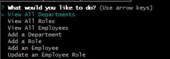
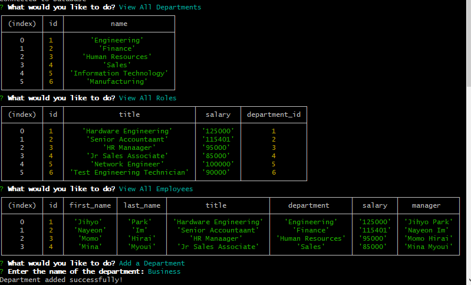

# employee-tracker

# Description
The objective of this project is to build a command-line application from scratch to manage a company's employee databse, using Node.js, Inquirer, and MySQL. The application works by having the user choose between the different options of the command prompt and from there it will either display information, add information, or update information for the employees or departments of the database. Predetermined information has already been added onto seeds.sql.

The databse will be called employees_db and it will contain three tables (department, role, and employee). Each table will have a variable called "id", which will be used as the PRIMARY KEY. The role table will have a FOREIGN KEY called department_id, which would reference from the id variable in the department table. The employee table will have two FOREIGN KEYS, one that is being referenced from id in the role table and the other being from the id from employee table. 

# Technology Used
- Inquirer version. 8.2.4
- Node.js
- MySQL

# Testing

Command-Line Prompt that user can choose each option

Examples of the prompts that the user chooses

# Live-Recording
[Live Recording](https://drive.google.com/file/d/1DqMLKbYUHPlHgTjSeV4wC2y0MngW_BJn/view)
